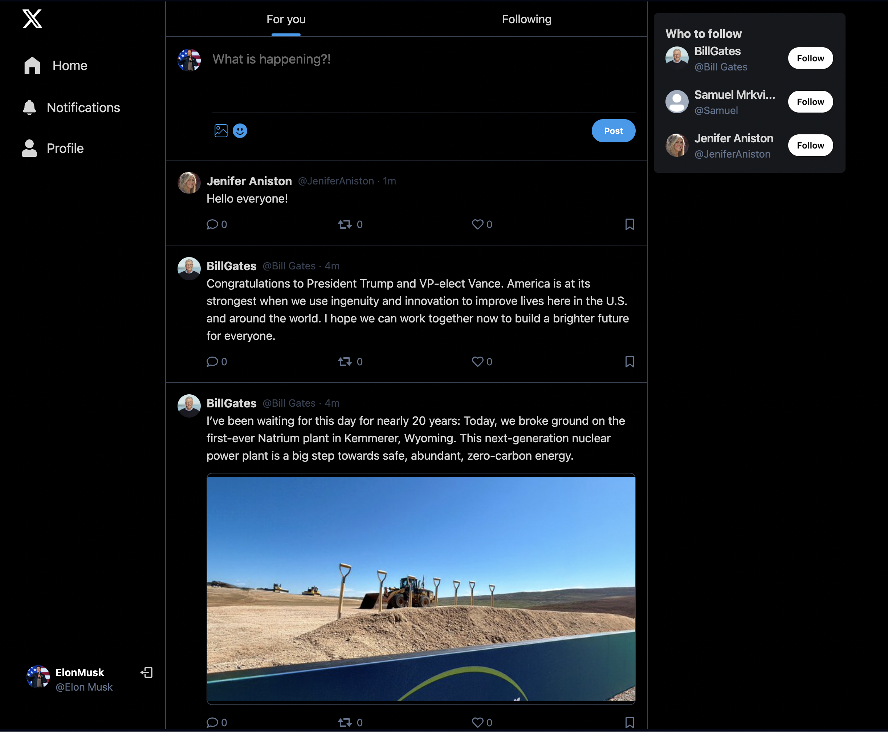
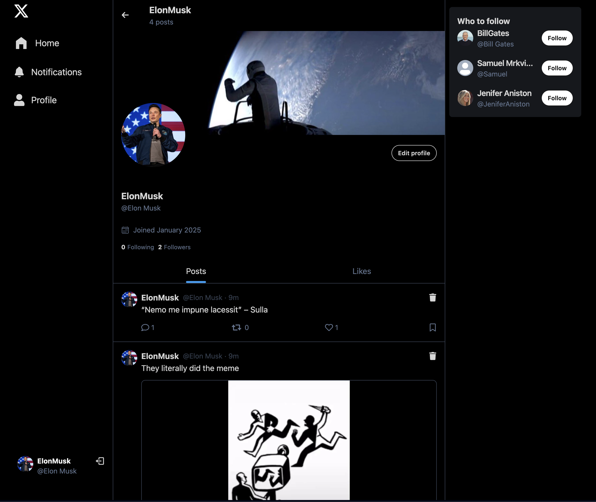
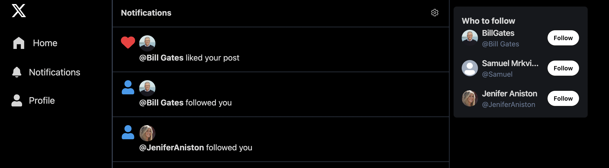

# X-Clone: A Twitter/X Clone Application

This is a **Twitter/X Clone** application designed to emulate the core functionalities of modern social media platforms. It’s built using the **MERN stack** and styled with **TailwindCSS**, providing a sleek and responsive user experience.

---

## Features

### User Functionality

- **Authentication & Authorization**: Secure sign-up/login using JSON Web Tokens (JWT).
- **Follow System**: Follow and unfollow other users, with a list of suggested users to follow.
- **Create Posts**: Share your thoughts or media with others.
- **Delete Posts**: Ability to delete your own posts.
- **Comment System**: Engage with posts through comments.
- **Like Posts**: Interact with posts by liking them.
- **Profile Management**:
  - Update your profile information (name, bio, etc.).
  - Change your cover photo and profile picture.

### Media Management

- **Image Uploads**: Upload images directly to posts using **Cloudinary** for secure and fast image hosting.

### Notifications

- Stay updated with notifications for likes, and followers.

### Data Fetching & Caching

- **React Query**: Efficient data fetching, caching, and synchronization for an optimized user experience.

### Deployment

- The application is deployed and ready for public use, ensuring fast and secure access.

---

## Screenshots

### Home Page

### User Profile

### Notifications

---

## Technologies Used

### Backend

- **Node.js**: Server-side runtime environment.
- **Express.js**: Lightweight framework for building APIs.
- **MongoDB**: NoSQL database to store user data, posts, and comments.
- **Mongoose**: ODM library for MongoDB.
- **JSON Web Token (JWT)**: For secure authentication.
- **Cloudinary**: For image uploads and storage.
- **bcryptjs**: For secure password hashing.

### Frontend

- **React.js**: Frontend library for building dynamic user interfaces.
- **React Router**: For seamless navigation between pages.
- **React Query**: Handles server-state management, caching, and data fetching.
- **React Icons**: Icons for enhancing the user interface.
- **React Hot Toast**: For custom toast notifications.
- **TailwindCSS**: Utility-first CSS framework for rapid UI development.
- **DaisyUI**: Pre-built, customizable components to accelerate design.

---

## How to Use

1. Open the application in your browser: [https://mern-x-clone-app.onrender.com].
2. Sign up for a new account or log in using your credentials.
3. Explore the platform:
   - Follow users, create posts, and engage with the community.
   - Manage your profile and upload images.
   - Receive real-time notifications for interactions.
4. Enjoy a fast, responsive, and modern social media experience.

---

## Deployment

The application is deployed on Render, ensuring free and seamless access.
